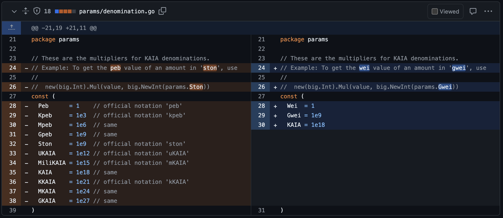

# 들어가며

> 이 글은 Klaytn에 대해서 사전지식이 있는 개발자를 대상으로 작성하였습니다.

Kaia v1.0.0 테스트넷 ‘Kairos’가 출시되었다. 이 글에서는 Klaytn과 Kaia의 기술적 및 인터페이스 차이점을 살펴본다.

"기술적인 관점에서는 Klaytn 네트워크를 기반으로 Kaia 체인이 작동하는 형태" - [토큰 스왑 안내](https://klaytn.foundation/kr/%ec%8b%a0%ea%b7%9c-kaia-%ec%b2%b4%ec%9d%b8-%eb%9f%b0%ec%b9%ad%ec%97%90-%eb%94%b0%eb%a5%b8-%ed%86%a0%ed%81%b0-%ec%8a%a4%ec%99%91-%ec%95%88%eb%82%b4/)

위 언급에서 알 수 있듯, 기존 Klaytn 네트워크에서 특정 블록넘버를 기준으로 '하드포크'하는 형태로 Kaia 네트워크로 전환된다. 


즉, Klaytn chaindata는 유지된다. 이러한 내용은 아래 스크린샷을 통해 확인 가능하다.


 

 
> [PR: Klay -> Kaia in RPC](https://github.com/klaytn/klaytn/pull/2159/files#diff-68088b8f4e5024ba6ee02b67cd1b979f738ba03c3da03912f29d3a377dc7cc27)

 
> [PR: Klaytn -> Kaia in comments](https://github.com/klaytn/klaytn/pull/2152)

이제부터 Kaia에 새롭게 추가된 3개의 기능에 대해 알아본다.

# `getTotalSupply(blockNumber)`

현재 Kaia 네트워크의 KAIA 물량과 관한 정보를 얻을 수 있는 Node가 제공하는 JSON-RPC API

즉, 특정 블록 시점의 총 공급량을 조회 가능하다.

기존에는 아래와 같은 API를 통해 정보를 얻을 수 있었으나, 이는 KAS 서비스의 API 일부로써 GroundX에 의해 자체적으로 제공되는 기능이였다. (값이 정확하지 않다는 뜻은 아니다)

```shell
$ curl https://klay-api.klaytnapi.com/v1/total-supply
5964547725.012343
```


```shell
curl -X POST https://public-en.kairos.node.kaia.io \
-H "Content-Type: application/json" \
-d '{
  "jsonrpc": "2.0",
  "method": "kaia_getTotalSupply",
  "params": ["0x95b0171"],
  "id": 1
}'

{
  "jsonrpc": "2.0",
  "id": 1,
  "result": {
    "number": "0x95b0171",
    "error": "cannot determine rebalance (kip103, kip160) burn amount: invalid character 'b' looking for beginning of value",
    "totalSupply": null,
    "totalMinted": "0x446c3b15f9926687d2c85d1b90019d1c2e928c0000",
    "totalBurnt": null,
    "burntFee": "0x6e82ae86b1eefafc9a15",
    "zeroBurn": "0x65c7159b3ef9a5c78da",
    "deadBurn": "0x32233a75159b8628cd",
    "kip103Burn": "0x6a15eef7e3a354cf657913",
    "kip160Burn": null
  }
}
```

해당 기능은 [Add klay_getTotalSupply API](https://github.com/klaytn/klaytn/pull/2148) PR을 통해 구현되었다. 

> 참고로 Geth에도 [Supply delta live tracer](https://github.com/ethereum/go-ethereum/pull/29347) 비슷한 기능이 추가되었다. 

```go
type SupplyManager interface {
	Start()
	Stop()
	GetTotalSupply(num uint64) (*TotalSupply, error)
}

type TotalSupply struct {
	TotalSupply *big.Int // The total supply of the native token. i.e. Minted - Burnt.
	TotalMinted *big.Int // Total minted amount.
	TotalBurnt  *big.Int // Total burnt amount. Sum of all burnt amounts below.
	BurntFee    *big.Int // from tx fee burn. ReadAccReward(num).BurntFee.
	ZeroBurn    *big.Int // balance of 0x0 (zero) address.
	DeadBurn    *big.Int // balance of 0xdead (dead) address.
	Kip103Burn  *big.Int // by KIP103 fork. Read from its memo.
	Kip160Burn  *big.Int // by KIP160 fork. Read from its memo.
}
```

PR을 간단히 살펴보면, 위 같은 구조체가 추가된것을 확인 가능하다.


```go
for lastAccRewardBlockNumber < CurrentBlock {
  // 누적 작업
}
logger.Info("Total supply big step catchup done")

sm.chainHeadSub = sm.chain.SubscribeChainHeadEvent(sm.chainHeadChan)
for {
  select {
  case <-sm.quitCh:
    return
  case head := <-sm.chainHeadChan:
    // 누적 작업

  }
}
```

또한 위와 같은 계산 로직도 확인 가능하다.


# Public Delegation


# Priority tip 

해당 기능은 간단히 말해 `EIP-1559`가 카이아 네트워크에 완전히 구현되었다고 이해하면 된다.

기존 클레이튼에는 baseFee 기능만 제공하고, TIP은 0으로 고정되었다.
> 스팸 Transaction을 막기 위한 목적으로 도입

이제는 `EIP-1559`와 동일한 Type:2 트랜잭션을 만들 수 있으며 Tip순으로 펜딩 트랜잭션이 정렬된다.


# 마치며
