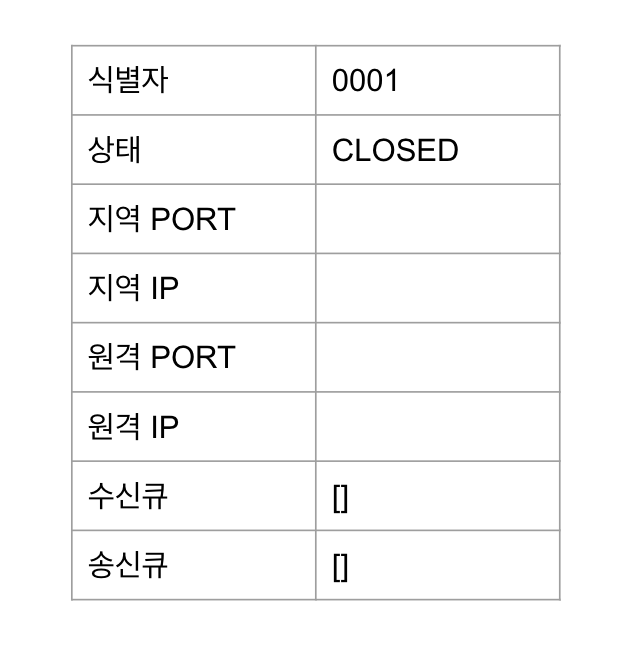
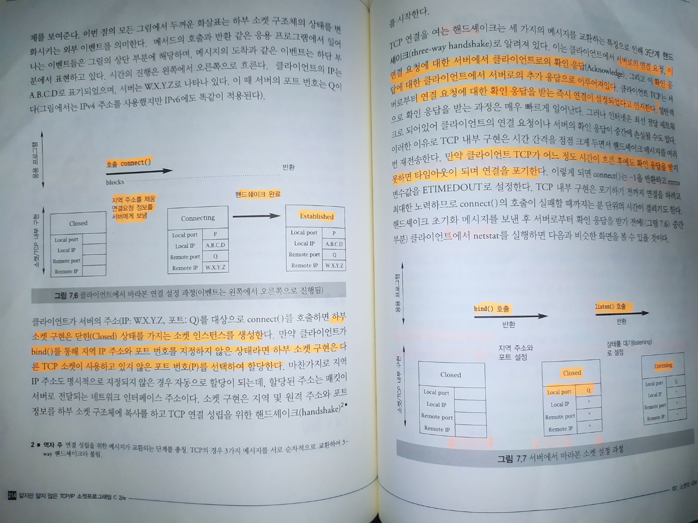

이 글은 `3 Way Handshake` 전후에 Socket 객체가 어떻게 생성되고, 변화해가는지를 설명하는 글이다.

C언어 코드는 생략하고 TCP/IP 이해에 필요한 로직만 담았다.

## 3 Way Handshake

 

가상 경로(socket) 생성을 위해, 서버는 OS에게 특정 포트에 연결 요청이 오면 자신에게 전달해 달라하며 기다리는데, 이를 `LISTEN`이라고 한다.

위와 같이 상대가 `LISTEN`하고 있을때, 그 유명한 `3-way handshaking`을 거쳐 클라이언트와 서버 사이의 소켓이 연결된다.

1. 클라이언트에서 서버로의 연결 요청
2. '연결 요청'에 대한 서버에서 클라이언트로의 확인 응답
3. '확인 응답'에 대한 클라이언트에서 서버로의 추가 응답

다시 자세히 설명해보자면

1. 클라이언트가 통신 상대인 서버측 OS에게 가상 경로 오픈을 의뢰하며 `SYN` 패킷 전송
2. 서버측 소켓은 `LISTENING`상태이기에 `ACK +SYN` 패킷 응답.
3. 클라이언트도 다시 `ACK`  패킷으로 응답하며 서버의 '새로운 소켓'이 생성되며 연결(`ESTABLISHED`)된다

> 서버의 새로운 소켓이 무슨 뜻일까? 아래에서 자세히 알아보겠다.

 

참고로 2번이 완료되었을때, 클라이언트 소켓은 `send()`가 가능하다.
- 서버는 아직 <`ACK`>을 받지 못하고 `SYN_RCV` 상태이지만, 클라이언트 소켓은 이미 `ESTABLISHED` 상태이기 때문이다.

 

## 소켓이란?

소켓은 응용 프로그램이 이를 통해 데이터를 송수신할 수 있는 추상화된 개념

쉽게 말해, 프로그램이 소켓에 데이터를 `write`하면, 다른 호스트에 있는 상대 프로그램은 소켓을 통해 데이터를 `read` 할 수 있게 된다.

 

또한 TCP/IP 의구현은 보통 호스트의 OS 내부에 이미 구현되어있기 때문에, 우리는 Socket을 이용해 쉽게 통신이 가능하다.
> 이 부분을 더 자세히 알고싶다면? [google.com에 접속해보자 (TCP 연결 과정)](/network/connect-google-with-tcp)

 

다만 실제로 프로그래밍을 할때는, 이미 소켓이 랩핑되어 있기 때문에 직접 접근(write, read)하는 경우는 드물것이다.

## 소켓 구조체란?

소켓 구조체란 소켓 계층과 TCP 구현 내부의 모든 데이터 구조체로 소켓 추상화에 대한 상태 정보를 포함한다.

위는 `socket()` 호출 후 막 생성된 구조체의 모습이다.
- 지역 포트&IP는 `bind()`시 설정된다.
- 원격 IP와 PORT가 존재한다면, 지역 소켓은 '원격 소켓'에 연결된 것이다.
- 즉 아무것도 연결되지 않은 상태(`CLOSED`)라는 것을 알 수 있다.
- 상태는 TCP 소켓의 경우, 추가적인 프로토콜 상태 정보이다 

## netstat

`netstat -nap`  명령어를 사용하면 현재 존재하는 소켓 인스턴스들을 볼 수 있다.
- 상태전이가 매우 빠르게 일어나서 동일 결과를 보긴 힘들다.

 

아래는 `netstat -nap`의 **가상 결과**

|Proto|RecvQ|SendQ|LocalAddress|ForeignAddress|State
|---|---|---|---|---|---|
|tcp|0|0|0.0.0.0:8080|0.0.0.0:*|LISTEN|
|tcp|0|0|128.133.190.219.34077|4.71.104.187:80|TIME_WAIT|
|tcp|0|0|128.133.190.219.43346|79.62.132.8:22|ESTABLISHED|

- 각 소켓의 <프로토콜, 송/수신 큐에 존재하는 바이트, 지역주소, 원격 주소, 상태> 정보를 확인 가능하다

## TCP 클라이언트 with C

1. `socket()`를 이용하여 TCP 소켓을 생성
   - 하부 소켓 구현은 `CLOSED`(닫힌) 상태를 가지는 소켓 인스턴스를 생성한다. 
   - <소켓 구조체> 형태는 위에서 살펴보았다.

 

2. `connect()`를 이용하여 서버와의 연결을 설정
   - 이때 소켓에 남는 Local Port가 자동할당 된다.
   - 아니면 `connect()` 호출 전에 주소&포트를 `bind()`할 수 있다.
   - 이때 `3-way handshake`가 일어난다. (단계가 진행함에 따라 상태는 `CLOSED > SYN_SENT > ESTABLISHED`

 

3. `send()`, `recv()`를 이용하여 통신을 수행

 

4. `close()`를 이용하여 연결을 종료

 

참고로 단 한번의 `send()` 호출로 데이터를 보내도, 상대방은 단 한번의 `recv()` 호출로 데이터를 모두 받지 못할 수 있다.

또한 TCP는 신뢰성 있는 서비스를 제공하기 때문에, <전송된 데이터의 복사본>이 **상대방이 성공적으로 받을때까지 TCP 내부 구현에 의해 유지 관리**되어야 한다.

- 즉 `send()` 함수의 호출이 성공은 데이터의 전송/전송 성공을 의미하지 않고, 그저 <`지역 send buffer`>에 복사되었다는것을 의미한다.

 

|Proto|RecvQ|SendQ|LocalAddress|ForeignAddress|State
|---|---|---|---|---|---|
|tcp|0|0|10.21.44.33:43346|192.0.2.8:80|ESTABILSHED|
- `10.21.44.33`호스트에 `43346` 포트에 할당된 소켓이, `192.0.2.8:80` 소켓으로 연결됬음을 알 수 있다.
## TCP 서버 with C

1. `socket()`을 통해 TCP 소켓을 생성
   - <하부 소켓 구현>은 `CLOSED`(닫힌) 상태를 가지는 소켓 인스턴스를 생성한다. 

 

2. `bind()`를 통해 소켓에 내부주소, 포트를 할당
   - 중복, 권한 문제로 주소&포트를 소켓에 `bind()`하는데 실패할 수 있다.

 

3. `listen()`을 통해 해당 포트가 연결을 받아드리도록 OS에 알림
   - `listen()` 함수는 소켓 내부상태 변화를 일으켜, 클라이언트의 `connect()` 요청을 버리지 않고 `accept()`를 위한 대기화(queue)한다.
   - 즉 `listen()` 호출 전에는 서버로 향하는 어떠한 연결 요청도 거부된다.
   - 서버 소켓의 상태는 `LISTEN`으로 변경.

 

4. 아래 일을 반복
     - `accept()`를 통해 각 클라이언트와 통신에 필요한 **새로운 (연결된) 소켓**을 획득
     - 새로운 연결된 클라이언트 소켓에 `send()`, `recv()`를 호출하여 통신을 수행
     - `close()`를 통해 클라이언트와 연결 종료
  
## `accept()` 를 자세히 알아보자

`accept()`를 호출하면 만들어지는 새로운 소켓이란 무엇인가?

처음에 3 way handsahke 과정을 설명할때도, '새로운 소켓'을 언급했었다.
- "클라이언트도 다시 `ACK`  패킷으로 응답하며 서버의 '새로운 소켓'이 생성되며 연결(`ESTABLISHED`)된다"

 
 

`listen()`을 하고 있는 socket은 **실제로 송수신에 사용되지 않고, 클라이언트를 연결하기 위한 '새로운 소켓'을 획득하기 위한 수단으로 사용된다**

다시 말해, client의 `connect()` 요청 이후, **서버는 <새로운 소켓>을 생성하는** `accept()`를 호출한다. 
- 새로 생성된 소켓의 상태는 '연결중' (구현 내부에서는 `SYN_RCVD`)
- 그리고 클라이언트로부터 `ACK` 를 받고 handshake가 완료되면 `ESTABILSHED`
- 연결이 완료됬을때, `acccept()` 함수는 결과값 <새로운 소켓의 식별자>를 반환된다.

 

이 과정이 끝나고 `netstat` 명령을 사용하면 아래 두 소켓이 존재하고 있을것이다.
- 여전히 대기(`LISTENING`)상태의 소켓 
- 새로 만들어진 연결된(`ESTABILSHED`) 소켓

이때 생성되는 소켓은 지역주소,지역포트가 <listen 중인 소켓>과 같다

|Proto|RecvQ|SendQ|LocalAddress|ForeignAddress|State
|---|---|---|---|---|---|
|tcp|0|0|0.0.0.0:**80**|0.0.0.0:*|LISTEN|
|tcp|0|0|x.x.x.x:**80**|4.71.104.187:43422|ESTABILSHED|

## 마지막으로

이 글의 내용은 `<Bj퍼블릭> TCP/IP 소켓 프로그래밍 C 2판` 내용을 바탕으로 작성했습니다!

 

아무래도 글로 담아내다보니, 생략된 부분이 많습니다. 더 자세히 알고싶다면 구매 추천드립니다.

초판 발행일이 무려 2009년이지만 매우 유익한 책입니다. 

> 교보문고 구경하다가 발견하고 오? 하고 구매했다는...

요즘 TCP/IP 에 대해서 공부하고 있는데, 내부 구조는 어떻게 되어있는지 인터넷 검색만으로는 알기가 힘들었지만, 이 책 덕분에 좀 더 알게 된 것 같습니다

물런 이 책 하나가 TCP/IP에 대한 모든 지식을 담고 있는건 아니라 어느정도 학습 후에 `C언어는 어떻게 소켓을 다룰까?`라는 고민을 가지고 읽어보면 좋을것 같습니다

 

마지막으로 오류가 있다면 편하게 댓글 남겨주세요!

> 이 단순한 과정이 매번 어렵게 느껴지는 이유는 대부분은 고급언어로 소켓을 랩핑해서 사용하기 때문에 소켓에 문제가 생기지 않는 한 로우 레벨로 내려가 확인할 일이 흔치 않고, 또한 확인하는 방법을 아는 이도 드물기 때문일 겁니다. 
> 
> [CLOSE_WAIT & TIME_WAIT 최종 분석](https://tech.kakao.com/2016/04/21/closewait-timewait/)에서